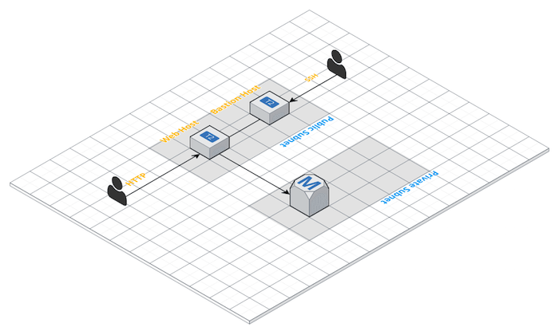

Cloudformation Playground
=========================

With this nested CloudFormation scripts, you can build the simple architecture displayed below:

The web instance you can find Apache, PHP (and php-mysql extension) already installed.

- The Web Instance is in a Public subnet with the SSH access allows only from the Bastion Host Security groups
- The Bastion Host is in a Public subnet and the SSH access is allowed only from the CIDR block provided as parameter.
- The RDS DB instance is in a Private subnet and the connections to it are allowed only from the instances in the public subnet.

# Quick start

1. Upload on a S3 bucket all the CloudFormation templates in the project folder but the **app.yml**
2. Provide the following parameters:
    1. KeyName: the key-pair name
    2. SSHCidr: The SSH access to the the Bastion Host is allowed only from the CIDR block provided
    3. DBName: The DB name 
    4. DBUsername: The DB username
    5. DBPassword: The DB password
    6. NetworkTemplateURL: The URL of S3 object where the template **network.yml** has been stored
    7. SecurityTemplateURL: The URL of S3 object where the template **security.yml** has been stored
    8. IAMTemplateURL: The URL of S3 object where the template **iam.yml** has been stored
    9. DBTemplateURL: The URL of S3 object where the template **dbinstance.yml** has been stored
    10. InstanceTemplateURL: The URL of S3 object where the template **instances.yml** has been stored
3. Run the command:
     `aws cloudformation create-stack --stack-name {your_stack_name_here} --template-body file://app.yml --capabilities CAPABILITY_NAMED_IAM --parameters {your_parameters_file_here}`

